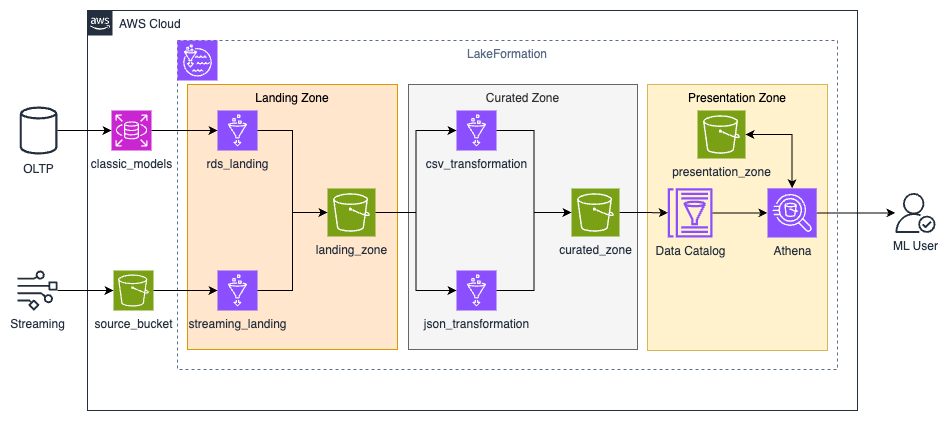

# Building a Data Lakehouse with AWS Lake Formation and Apache Iceberg

This project creates a Data Lakehouse with a medallion architecture using AWS Lake Formation and Apache Iceberg tables. It utilizes data from a relational database (MySQL in Amazon RDS) and a streaming service (data in Amazon S3).  AWS Glue jobs populate the architecture, and Amazon Athena is used for querying. Infrastructure as Code (IaC) is implemented using Terraform.

## Table of Contents

-   [1 - Introduction and Setup](#1)

    -   [1.1 - Introduction](#1-1)
    -   [1.2 - Setting up the Data Lakehouse](#1-2)
-   [2 - Architecture of the Data Lakehouse](#2)
-   [3 - Landing Zone](#3)

    -   [3.1 - RDS and Streaming Landing](#3-1)
    -   [3.2 - Deployment](#3-2)
-   [4 - Curated Zone](#4)

    -   [4.1 - CSV Transformation](#4-1)
    -   [4.2 - JSON Transformation and Apache Iceberg](#4-2)
    -   [4.3 - Deployment](#4-3)
-   [5 - Presentation Zone](#5)
-   [6 - \[Optional and Not Graded] - Apache Iceberg Features](#6)

    -   [6.1 - Schema Evolution](#6-1)
    -   [6.2 - Versioning with Iceberg](#6-2)
-   [7 - \[Optional and Not Graded] - Lake Formation Permissions](#7)
-   [8 - Environment Clean Up](#8)

## 1 - Introduction and Setup

### 1.1 - Introduction

This project simulates a data engineering scenario for a retailer of scale model cars.  The retailer's historical purchase and customer data resides in a MySQL database. A new web application tracks user ratings via a streaming service. This project builds a data lakehouse in AWS to manage and analyze this data. It uses the [MySQL Sample Database](https://www.mysqltutorial.org/mysql-sample-database.aspx) dataset.

### 1.2 - Setting up the Data Lakehouse

The data lakehouse uses an S3 bucket with the following folder structure:

-   `landing_zone`
-   `curated_zone`
-   `presentation_zone`

AWS Lake Formation is used for data lake governance.  Initial setup involves granting permissions to the Glue Job role (`de-c3w2lab2-glue-role`).  The provided code snippets using `boto3` demonstrate this process, including granting data location access to the S3 bucket and database access to `curated_zone` and `presentation_zone` databases in the Glue Catalog.

A shell script (`scripts/setup.sh`) is used to configure the environment.

## 2 - Architecture of the Data Lakehouse

The architecture follows a medallion pattern:

Key components:

* **Data Sources:**
    * MySQL database in Amazon RDS.
    * Streaming data (product ratings) in S3 (`source_bucket`).
* **Medallion Layers:**
    * **Landing Zone:** Raw data is ingested from RDS and S3.
        * RDS data is extracted via a Glue job and stored as CSV.
        * Streaming data is extracted from S3 (JSON format) using a Glue job.
    * **Curated Zone:** Data is transformed, enriched, and cataloged in the Glue Data Catalog.
        * CSV data is enriched with metadata, schema is enforced, and stored in Parquet format via a Glue job.
        * JSON (ratings) data is joined with RDS data, and stored as an Apache Iceberg table using Glue Jobs.
    * **Presentation Zone:** Data is transformed into business objects using SQL queries in Amazon Athena, stored as Apache Iceberg tables.
* **End Users:** Data analysts can query the data using Amazon Athena.  Data access is managed via Lake Formation.

## 3 - Landing Zone

### 3.1 - RDS and Streaming Landing

* `terraform/assets/landing_etl_jobs/de_c3w2a1_batch_ingress.py`: Glue job to ingest data from RDS.
* `terraform/modules/landing_etl/glue.tf`: Terraform configuration for the RDS Glue connection.  The `connection_properties` map needs to be completed with the JDBC URL, username, and password.
* `terraform/assets/landing_etl_jobs/de_c3w2a1_json_ingress.py`: Glue job to ingest JSON data from S3.

The code snippets demonstrate how to copy these Glue scripts to the S3 bucket.

### 3.2 - Deployment

* `terraform/main.tf`:  Only the `landing_zone` module should be uncommented for this stage.
* Terraform is used to deploy the resources: `terraform init`, `terraform plan`, `terraform apply`.
* Glue jobs (`glue_bucket_ingestion_job`, `glue_rds_ingestion_job`) are executed using `aws glue start-job-run`.
* Job status is checked with `aws glue get-job-run`.
* `aws s3 ls` commands are used to verify the output in the landing zone.

## 4 - Curated Zone

### 4.1 - CSV Transformation

* `terraform/assets/transform_etl_jobs/de_c3w2a1_batch_transform.py`:  Glue script for transforming CSV data.  The `add_metadata` and `enforce_schema` functions need to be completed.

### 4.2 - JSON Transformation and Apache Iceberg

* Two Glue jobs are used: one to join JSON and CSV data, and another to store JSON data as Apache Iceberg tables.
* `terraform/assets/transform_etl_jobs/de_c3w2a1_ratings_to_iceberg.py`:  Glue script to save JSON data into Apache Iceberg.  The `SqlQuery0` variable needs to be completed.
* `terraform/modules/transform_etl/glue.tf`:  Terraform configuration for Glue jobs.  The `timeout`, number of workers, `--job-language`, and `--datalake-formats` parameters need to be configured.
* Apache Iceberg format:
    * **Schema Flexibility**: Enables seamless evolution of data structures without requiring a full dataset rewrite.
    * **Transactional Integrity**: Ensures atomic commits, guaranteeing data consistency and reliability.
    * **Data Partitioning**: Enhances query performance by partitioning based on one or more columns.
    * **Comprehensive Metadata Management**: Stores metadata separately from the data files, simplifying management and queries.
* `terraform/assets/transform_etl_jobs/de_c3w2a1_json_transform.py`:  Glue script to join JSON and RDS data for use by the ML team.  The `SqlQuery1` variable needs to be completed.
* Code snippets show how to copy these scripts to the S3 bucket.

### 4.3 - Deployment

* `terraform/main.tf`:  The `transform_etl` module needs to be uncommented.
* `terraform/outputs.tf`:  Outputs for the `transform_etl` module should be uncommented.
* Terraform is used to deploy the resources.
* Glue jobs (`glue_csv_transform_job`, `glue_ratings_transform_job`, `glue_ratings_to_iceberg_job`) are executed.
* `aws s3 ls` commands are used to inspect the results in the curated zone.

## 5 - Presentation Zone

* Amazon Athena is used to query the curated data.
* `awswrangler` library is used to run `CREATE TABLE AS` queries.

The code demonstrates granting access to tables in the `curated_zone` to the `voclabs` role and how to create Iceberg tables based on queries. Specifically, it creates the following tables:

* `ratings`: Based on the `curated_zone.ratings` table.
* `ratings_for_ml`: Includes data for the ML team, casts `process_ts` to varchar.
* `sales_report`:  Contains average sales per month and year, based on `curated_zone.orders` and `curated_zone.orderdetails`.
* `ratings_per_product`: Contains average rating and review count per product from `curated_zone.products` and `curated_zone.ratings`.

The code shows how to grant permissions on the `presentation_zone` tables and how to query them using `awswrangler`.

## 6 - \Apache Iceberg Features

### 6.1 - Schema Evolution

This section demonstrates how to add a new column (`ratingtimestamp`) to the `ratings` table in the curated zone.

* `terraform/assets/alter_table_job/de_c3w2a1_alter_ratings_table.py`: Glue script used to alter the table.
* The code shows how
